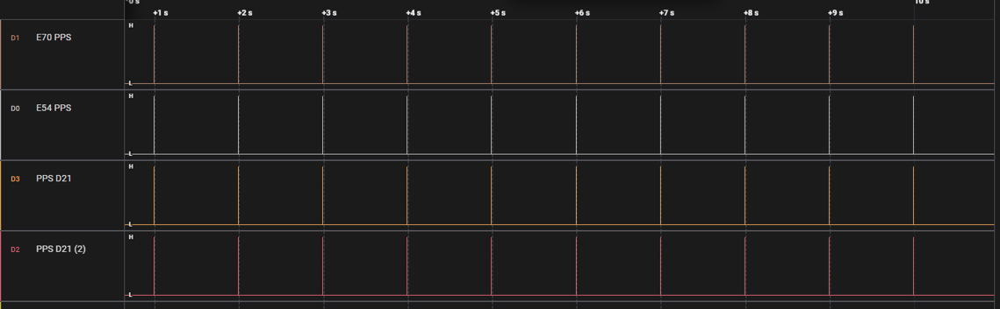

# Time Synchronization sample application for LAN8650/1

This repository contains the Microchip sample application for LAN8650/1 Time Sync source code and example applications. 
The Implementation includes a Clock Source implemenation and Clock Follower Implementation.

The code synchronizes the slave's clock with the master's clock using Sync and Follow-up messages.
It calculates the time differences and rate ratios between the master and slave clocks.
Based on the calculated offset and the current synchronization status, it adjusts the slave clock incrementally, applying various filters to ensure stability and accuracy.
The code handles different synchronization states (UNINIT, MATCHFREQ, HARDSYNC, COARSE, FINE) to gradually achieve precise time synchronization.

Our comprehensive 10BASE-T1S portfolio has the technology
to meet your range, data rate, interoperability, frequency and topology needs.
Please contact the Microchip support in case of issues and questions.

- [10BASE-T1S Support](https://www.microchip.com/support)

## Results

Those applications have no deep integration of the TC6 protocol driver into MPLAB® Harmony 3. If this is desired, please refer to the official LAN865x MPLAB Harmony v3 driver and example applications in the corresponding repository:
- [MPLAB® Harmony 3 - 10BASE-T1S-Examples](https://github.com/Microchip-MPLAB-Harmony/net_10base_t1s)

Note: Please refer to AN4964 provided on the Microchip LAN865x product websites:
- [LAN8650](https://www.microchip.com/en-us/product/lan8650)
- [LAN8651](https://www.microchip.com/en-us/product/lan8651)

____

